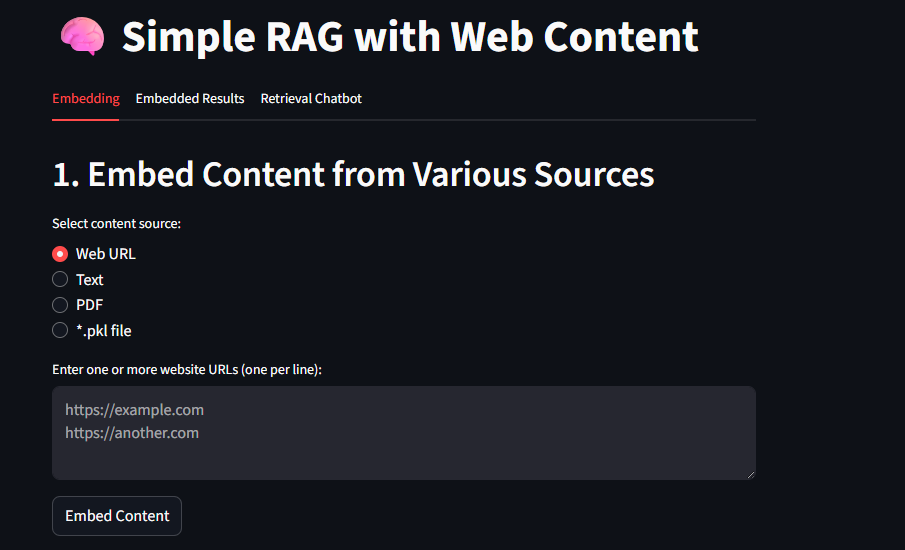
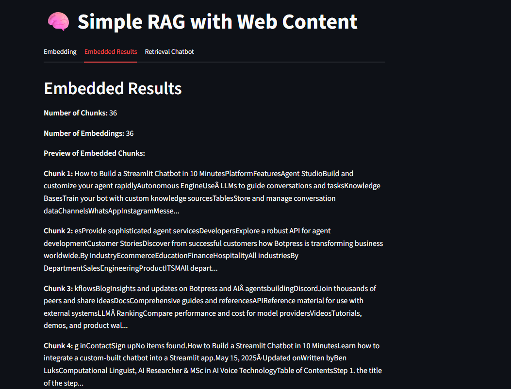
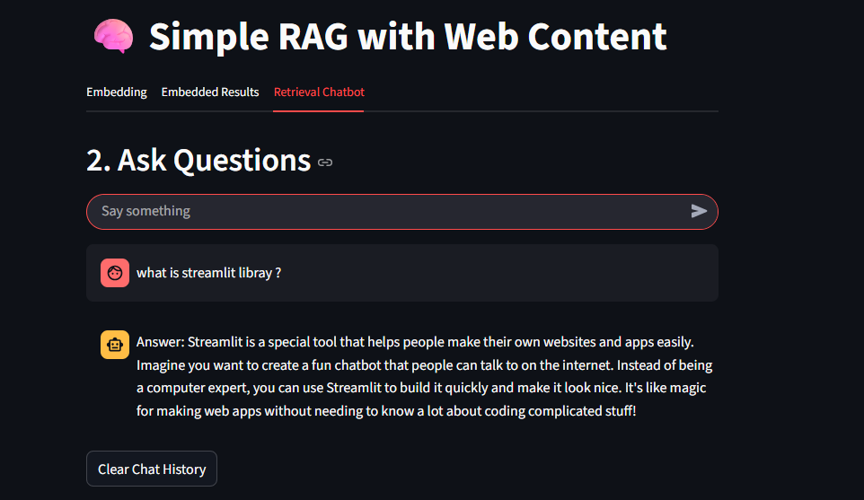

# Simple RAG with Web Content

This project showcases a simple Retrieval-Augmented Generation (RAG) application built with Streamlit, OpenAI, and web-based content. The app enables you to extract text from a website, generate and store embeddings, and ask questions based on the embedded knowledge.

In this example, OpenAI’s embedding and language models are used. However, if you don’t have an OpenAI account or prefer a free alternative, you can replace them with open-source models available on platforms like Hugging Face

## Features

### Fetch and embed contents
   
The demo provides several ways to embed content, including from a web URL, text file, or PDF. The website text is first split into manageable chunks, which are then embedded using OpenAI's embedding API.
  
### Save and load embeddings:

Save embeddings and chunks to a `.pkl` file and reload them later if you want, the purpose is to save the cost for everytime you use the embedding model of openai.

### Query or Question answering 

Ask questions in a chat interface. The app retrieves the most relevant chunks and uses OpenAI's GPT model to answer your question using the context.

## GUI

The application features a user-friendly GUI built with Streamlit, organized into three main tabs:

- **Embedding Tab:**  
  Allows you to select the content source (Web URL, text file, PDF, or existing `.pkl` file), embed the content, and (optionally) save the embeddings to a `.pkl` file for later use. You can input multiple URLs, upload text or PDF files, and manage your embeddings easily.

- **Embedded Results Tab:**  
  Displays a summary of the embedded content, including the number of chunks and a preview of the first few embedded text chunks. This helps you verify what content has been processed and is available for retrieval.

- **Retrieval Chatbot Tab:**  
  Provides a chat interface where you can ask questions about the embedded content. The app retrieves the most relevant chunks and uses OpenAI's GPT model to answer your question using the provided context.

The GUI is designed to make the workflow intuitive:  
1. **Embed content** from your chosen source.  
2. **Review embedded results** to confirm the content.  
3. **Ask questions** and get answers based on your embedded knowledge.

Please see the image below for reference:
* Tab1: Embedding Tab
  


* Tab2: Embedded Results Tab



* Tab3: Retrieval Chatbot Tab



This demo uses the Python library Streamlit to create the GUI. You can learn more about this library on its [official website](https://docs.streamlit.io/get-started/tutorials).

## Requirements

- Python 3.8+
- [OpenAI API key](https://platform.openai.com/)
- The following Python packages:
  - streamlit
  - python-dotenv
  - requests
  - beautifulsoup4
  - openai
  - numpy
  - scikit-learn

## Installation

1. **Clone the repository:**
    ```sh
    git clone <your-repo-url>
    cd rag-demo
    ```

2. **Install dependencies:**
    ```sh
    pip install -r requirements.txt
    ```

3. **Set up environment variables:**
    - Create a `.env` file in the project root:
      ```
      OPENAI_API_KEY=your_openai_api_key_here
      ```

## Usage

1. **Run the Streamlit app:**
    ```sh
    streamlit run rag_app.py
    ```
    You can also run the app using the batch file (Windows) or shell script (Linux). I've set everything up in the scripts, including creating and activating a Python virtual environment.
    ```sh
    setup_env.bat
    ```
    or

     ```sh
    ./setup_env.sh
    ```

You can also deploy your production app using cloud services such as: 
- [Streamlit Community Cloud](https://streamlit.io/cloud) (free for public repos)
- [Render](https://render.com/)
- [Heroku](https://www.heroku.com/)
- [Azure Web Apps](https://azure.microsoft.com/en-us/products/app-service/)

I've already deployed the app on Streamlit Community Cloud — feel free to check it out:

👉 [yushinragdemo](https://yushinragdemo.streamlit.app/)

2. **In the web UI:**
    - Enter a website URL and click "Embed Content" to fetch and embed the content.
    - Optionally, click "Embed Content and save to *.pkl file" to save embeddings for later use.
    - Click "Load the embedded *.pkl file" to reload saved embeddings.
    - Use the chat input to ask questions about the embedded content.

## File Structure

- `rag_app.py` — Main Streamlit application.
- `embeddings.pkl` — Saved embeddings and chunks (generated at runtime).
- `README.md` — This file.

## Notes

- The app uses OpenAI's `text-embedding-3-small` model for embeddings and `gpt-4.1-nano` for answering questions.
- Ensure your OpenAI API key has access to the required models. Update the key in the ```sample.env``` file, then rename the file to ```.env```.
- For best results, use websites with mostly textual content.

## License

MIT