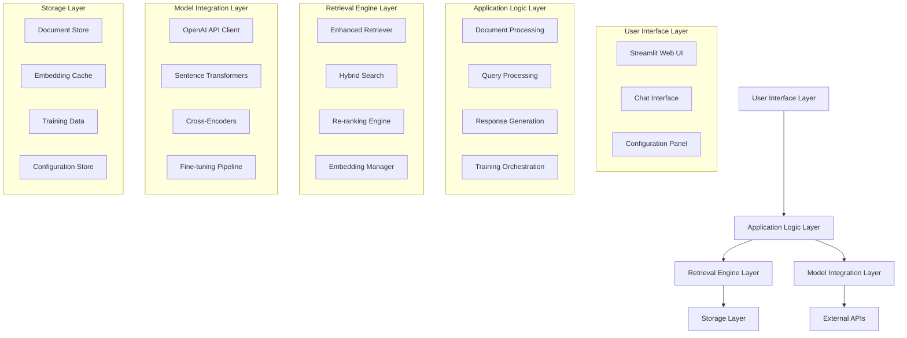
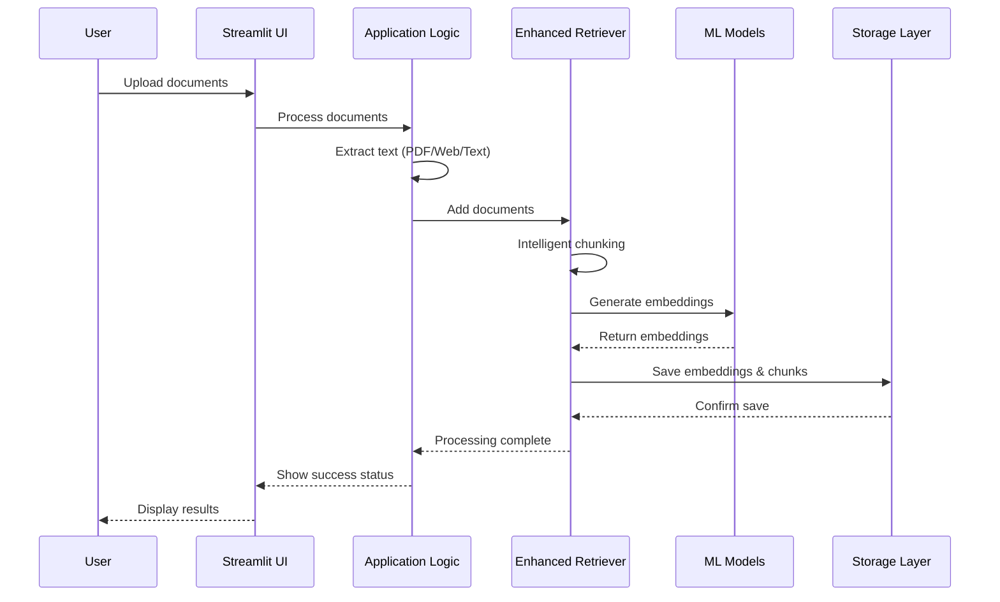
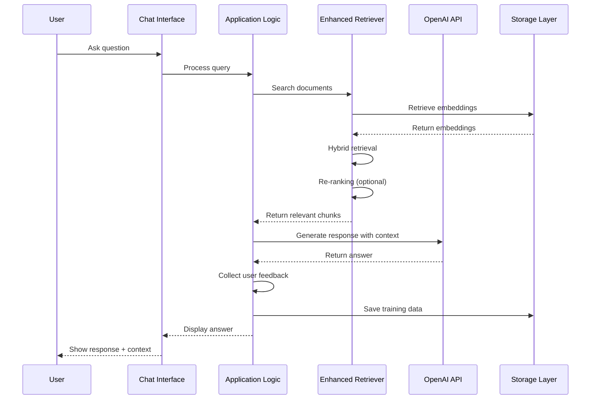
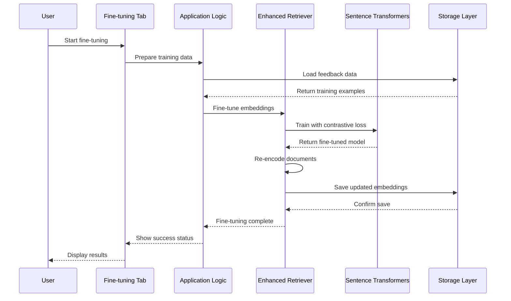

# RAG Demo System Design Document

## Table of Contents
1. [System Overview](#system-overview)
2. [Architecture Components](#architecture-components)
3. [Application Variants](#application-variants)
4. [Core Modules](#core-modules)
5. [Data Flow](#data-flow)
6. [Technology Stack](#technology-stack)
7. [API Design](#api-design)
8. [Storage Architecture](#storage-architecture)
9. [Performance Considerations](#performance-considerations)
10. [Security and Configuration](#security-and-configuration)
11. [Deployment Strategy](#deployment-strategy)
12. [Monitoring and Evaluation](#monitoring-and-evaluation)
13. [Future Enhancements](#future-enhancements)

---

## System Overview

### Purpose
The RAG (Retrieval-Augmented Generation) Demo is a comprehensive document processing and question-answering system that combines advanced retrieval techniques with large language models to provide accurate, context-aware responses based on uploaded documents.

### Key Capabilities
- **Multi-source Document Processing**: Web URLs, text files, PDFs
- **Advanced Retrieval Strategies**: Hybrid dense+sparse retrieval, re-ranking
- **Fine-tuning Support**: Domain-specific model adaptation
- **Interactive Chat Interface**: Real-time Q&A with context visualization
- **Performance Evaluation**: Built-in metrics and comparison tools
- **Training Data Collection**: User feedback loop for continuous improvement

### System Goals
- **Accuracy**: Provide relevant, contextually accurate answers
- **Scalability**: Handle large document collections efficiently
- **Usability**: Intuitive interface for non-technical users
- **Extensibility**: Modular design for easy enhancement
- **Performance**: Fast retrieval and response generation

---

## Architecture Components

### High-Level Architecture



### Component Responsibilities

#### User Interface Layer
- **Streamlit Web UI**: Primary user interface for all interactions
- **Chat Interface**: Conversational Q&A experience
- **Configuration Panel**: Real-time parameter adjustment

#### Application Logic Layer
- **Document Processing**: Text extraction, chunking, preprocessing
- **Query Processing**: Query understanding and expansion
- **Response Generation**: LLM integration and answer synthesis
- **Training Orchestration**: Fine-tuning workflow management

#### Retrieval Engine Layer
- **Enhanced Retriever**: Core retrieval system with multiple strategies
- **Hybrid Search**: Dense + sparse retrieval combination
- **Re-ranking Engine**: Cross-encoder based result refinement
- **Embedding Manager**: Vector embedding operations

#### Model Integration Layer
- **OpenAI API Client**: Integration with OpenAI services
- **Sentence Transformers**: Open-source embedding models
- **Cross-Encoders**: Re-ranking model implementations
- **Fine-tuning Pipeline**: Model adaptation capabilities

#### Storage Layer
- **Document Store**: Raw and processed document storage
- **Embedding Cache**: Vector embeddings persistence
- **Training Data**: User feedback and training examples
- **Configuration Store**: System settings and user preferences

---

## Application Variants

### 1. Simple RAG App (`rag_app.py`)
**Purpose**: Basic RAG implementation for learning and demonstration

**Features**:
- OpenAI embeddings with cosine similarity
- Simple text chunking (fixed size)
- Basic chat interface
- PDF and web content support
- Embedding persistence

**Use Cases**:
- Educational demonstrations
- Proof of concept implementations
- Simple document Q&A

### 2. Enhanced RAG App (`enhanced_rag_app.py`)
**Purpose**: Production-ready RAG system with advanced features

**Features**:
- Hybrid retrieval (dense + sparse)
- Cross-encoder re-ranking
- Intelligent semantic chunking
- Fine-tuning capabilities
- Performance evaluation tools
- User feedback collection
- Multiple embedding models

**Use Cases**:
- Enterprise document management
- Domain-specific knowledge bases
- Research and development platforms

### 3. Simple Navigation App (`simple-app.py`)
**Purpose**: Multi-page application framework

**Features**:
- Page navigation system
- Modular application structure
- Template for complex applications

**Use Cases**:
- Multi-feature application development
- Structured workflow implementations

---

## Core Modules

### Enhanced Retrieval Module (`enhanced_retrieval.py`)

#### EnhancedRetriever Class
```python
class EnhancedRetriever:
    def __init__(self, embedding_model, reranker_model, use_hybrid, use_reranking)
    def intelligent_chunk(self, text, chunk_size, overlap)
    def add_documents(self, documents, chunk_size)
    def dense_retrieve(self, query, k)
    def hybrid_retrieve(self, query, k, alpha)
    def retrieve_with_reranking(self, query, initial_k, final_k)
    def search(self, query, k, use_reranking)
    def fine_tune_embeddings(self, training_queries, relevant_docs, epochs)
    def save_index(self, filepath)
    def load_index(self, filepath)
```

**Key Capabilities**:
- **Intelligent Chunking**: Semantic boundary-aware text splitting using spaCy
- **Hybrid Retrieval**: Combines dense embeddings with BM25 sparse retrieval
- **Re-ranking**: Cross-encoder models for precision improvement
- **Fine-tuning**: Domain adaptation through contrastive learning
- **Persistence**: Index saving/loading for performance optimization

#### RetrievalEvaluator Class
```python
class RetrievalEvaluator:
    @staticmethod
    def calculate_recall_at_k(retrieved_docs, relevant_docs, k)
    @staticmethod
    def calculate_precision_at_k(retrieved_docs, relevant_docs, k)
    @staticmethod
    def calculate_mrr(retrieved_docs_list, relevant_docs_list)
```

**Evaluation Metrics**:
- **Recall@K**: Fraction of relevant documents in top-K results
- **Precision@K**: Fraction of relevant results in top-K
- **MRR**: Mean Reciprocal Rank for ranking quality

---

## Data Flow

### Document Ingestion Flow



### Query Processing Flow



### Fine-tuning Flow



---

## Technology Stack

### Core Technologies

#### Backend Framework
- **Streamlit**: Web application framework
  - Version: Latest stable
  - Purpose: UI rendering, session management, real-time updates
  - Benefits: Rapid development, Python-native, data science focused

#### Machine Learning Stack
- **Sentence Transformers**: Embedding models
  - Models: all-MiniLM-L6-v2, all-mpnet-base-v2, multi-qa-MiniLM-L6-cos-v1
  - Purpose: Document and query encoding
  - Benefits: Pre-trained, fine-tunable, efficient

- **Cross-Encoders**: Re-ranking models
  - Models: ms-marco-MiniLM-L-6-v2, ms-marco-MiniLM-L-12-v2
  - Purpose: Precise relevance scoring
  - Benefits: High accuracy, BERT-based architecture

- **OpenAI API**: Large language models
  - Models: GPT-4 variants, text-embedding-3-small
  - Purpose: Response generation, embeddings
  - Benefits: High quality, maintained, scalable

#### Data Processing
- **spaCy**: Natural language processing
  - Model: en_core_web_sm
  - Purpose: Intelligent text chunking, linguistic analysis
  - Benefits: Production-ready, fast, accurate

- **rank-bm25**: Sparse retrieval
  - Purpose: Keyword-based document ranking
  - Benefits: Classic IR algorithm, lightweight, effective

- **scikit-learn**: Machine learning utilities
  - Purpose: Cosine similarity, evaluation metrics
  - Benefits: Stable, well-documented, efficient

#### Document Processing
- **BeautifulSoup**: Web scraping
  - Purpose: HTML text extraction from URLs
  - Benefits: Robust parsing, handles malformed HTML

- **pdfplumber**: PDF text extraction
  - Purpose: Extract text from PDF documents
  - Benefits: Accurate text extraction, handles complex layouts

- **python-dotenv**: Configuration management
  - Purpose: Environment variable management
  - Benefits: Secure API key handling, development flexibility

### External Dependencies

#### Required Libraries
```python
streamlit              # Web UI framework
scikit-learn          # ML utilities
sentence-transformers # Embedding models
faiss-cpu            # Vector similarity search
beautifulsoup4       # Web scraping
openai               # OpenAI API client
pdfplumber           # PDF processing
python-dotenv        # Environment variables
requests             # HTTP client
transformers         # Transformer models
rank-bm25           # BM25 implementation
spacy               # NLP processing
torch               # Deep learning framework
datasets            # Dataset utilities
pandas              # Data manipulation
numpy               # Numerical computing
```

#### System Requirements
- **Python**: 3.8+
- **Memory**: 4GB+ RAM (8GB+ recommended for fine-tuning)
- **Storage**: 2GB+ for models and embeddings
- **GPU**: Optional (CUDA-compatible for faster inference)

---

## API Design

### Core API Interface

#### Document Management API
```python
class DocumentManager:
    def add_documents(self, documents: List[str], source_type: str) -> bool
    def remove_documents(self, document_ids: List[str]) -> bool
    def list_documents(self) -> List[DocumentInfo]
    def get_document_stats(self) -> DocumentStats
```

#### Retrieval API
```python
class RetrievalAPI:
    def search(self, query: str, k: int = 5, **kwargs) -> SearchResults
    def hybrid_search(self, query: str, alpha: float = 0.7) -> SearchResults
    def dense_search(self, query: str) -> SearchResults
    def rerank_results(self, query: str, candidates: List[Document]) -> SearchResults
```

#### Training API
```python
class TrainingAPI:
    def collect_feedback(self, query: str, results: List[Document], rating: int) -> bool
    def start_fine_tuning(self, epochs: int = 3) -> TrainingJob
    def get_training_status(self, job_id: str) -> TrainingStatus
    def load_training_data(self) -> TrainingDataset
```

#### Configuration API
```python
class ConfigurationAPI:
    def get_settings(self) -> SystemSettings
    def update_settings(self, settings: SystemSettings) -> bool
    def reset_to_defaults(self) -> bool
    def export_configuration(self) -> ConfigurationExport
```

### Data Models

#### Document Models
```python
@dataclass
class Document:
    id: str
    content: str
    metadata: Dict[str, Any]
    embedding: Optional[np.ndarray] = None
    source: str = ""
    timestamp: datetime = field(default_factory=datetime.now)

@dataclass
class DocumentChunk:
    document_id: str
    chunk_id: str
    content: str
    start_pos: int
    end_pos: int
    embedding: Optional[np.ndarray] = None
```

#### Search Models
```python
@dataclass
class SearchResult:
    document: Document
    score: float
    rank: int
    snippet: str

@dataclass
class SearchResults:
    query: str
    results: List[SearchResult]
    total_time: float
    retrieval_method: str
    parameters: Dict[str, Any]
```

#### Training Models
```python
@dataclass
class TrainingExample:
    query: str
    positive_documents: List[str]
    negative_documents: List[str]
    relevance_score: float
    timestamp: datetime

@dataclass
class TrainingJob:
    job_id: str
    status: str  # pending, running, completed, failed
    progress: float
    start_time: datetime
    end_time: Optional[datetime] = None
    metrics: Optional[Dict[str, float]] = None
```

---

## Storage Architecture

### Storage Components

#### Document Storage
```
/storage/
├── documents/           # Raw document storage
│   ├── text/           # Text files
│   ├── pdf/            # PDF files
│   └── web/            # Web-scraped content
├── embeddings/         # Vector embeddings
│   ├── dense/          # Dense embeddings
│   ├── sparse/         # Sparse features
│   └── index/          # Search indices
├── models/             # Fine-tuned models
│   ├── embeddings/     # Custom embedding models
│   ├── rerankers/      # Re-ranking models
│   └── checkpoints/    # Training checkpoints
└── training/           # Training data
    ├── feedback/       # User feedback
    ├── annotations/    # Manual annotations
    └── synthetic/      # Generated training data
```

#### Embedding Index Structure
```python
{
    "metadata": {
        "version": "1.0",
        "created_at": "2024-01-01T00:00:00Z",
        "model_name": "all-MiniLM-L6-v2",
        "chunk_size": 500,
        "overlap": 50,
        "total_documents": 100,
        "total_chunks": 1500
    },
    "documents": [
        {
            "id": "doc_001",
            "source": "https://example.com",
            "content": "Document content...",
            "chunks": [
                {
                    "id": "chunk_001",
                    "content": "Chunk content...",
                    "start_pos": 0,
                    "end_pos": 500,
                    "embedding": [0.1, 0.2, ...]
                }
            ]
        }
    ],
    "dense_embeddings": np.ndarray,  # Shape: (n_chunks, embedding_dim)
    "bm25_index": {
        "vocab": [...],
        "doc_freqs": [...],
        "idf": [...],
        "doc_lengths": [...]
    }
}
```

#### Configuration Storage
```python
{
    "system": {
        "embedding_model": "all-MiniLM-L6-v2",
        "reranker_model": "cross-encoder/ms-marco-MiniLM-L-6-v2",
        "chunk_size": 500,
        "overlap": 50,
        "use_hybrid": true,
        "use_reranking": true,
        "hybrid_alpha": 0.7
    },
    "user_preferences": {
        "ui_theme": "light",
        "results_per_page": 5,
        "show_confidence_scores": true,
        "auto_save_feedback": true
    },
    "api_settings": {
        "openai_model": "gpt-4o-mini",
        "max_tokens": 500,
        "temperature": 0.1,
        "timeout": 30
    }
}
```

#### Training Data Format
```python
{
    "version": "1.0",
    "sessions": [
        {
            "session_id": "session_001",
            "timestamp": "2024-01-01T00:00:00Z",
            "examples": [
                {
                    "query": "What is machine learning?",
                    "retrieved_documents": ["doc_001", "doc_002"],
                    "user_rating": 1,  # 1=helpful, 0=not helpful
                    "relevance_scores": [0.95, 0.87],
                    "feedback_text": "Very helpful response"
                }
            ]
        }
    ],
    "statistics": {
        "total_examples": 150,
        "positive_examples": 120,
        "negative_examples": 30,
        "avg_rating": 0.8
    }
}
```

---

## Performance Considerations

### Retrieval Performance

#### Optimization Strategies
1. **Two-Stage Retrieval**
   - Stage 1: Fast candidate generation (BM25 or simple embeddings)
   - Stage 2: Precise re-ranking with cross-encoders
   - Benefit: 10-100x speed improvement

2. **Embedding Caching**
   - Cache document embeddings for reuse
   - Use memory-mapped files for large indices
   - Implement LRU eviction for memory management

3. **Batch Processing**
   - Process multiple queries simultaneously
   - Vectorize similarity computations
   - Use GPU acceleration when available

#### Performance Metrics
```python
{
    "retrieval_latency": {
        "p50": 150,  # milliseconds
        "p95": 500,
        "p99": 1000
    },
    "throughput": {
        "queries_per_second": 50,
        "documents_per_second": 1000
    },
    "resource_usage": {
        "memory_mb": 2048,
        "cpu_percent": 45,
        "gpu_percent": 20
    }
}
```

### Scaling Considerations

#### Horizontal Scaling
- **Load Balancing**: Distribute queries across multiple instances
- **Sharding**: Partition document index by domain or date
- **Caching**: Redis/Memcached for frequently accessed embeddings

#### Vertical Scaling
- **Memory Optimization**: Use quantized embeddings (8-bit vs 32-bit)
- **Model Optimization**: Distilled models for faster inference
- **Index Optimization**: Approximate nearest neighbor search (FAISS)

#### Resource Requirements by Scale
```python
{
    "small": {  # <10K documents
        "memory": "4GB",
        "cpu": "2 cores",
        "storage": "10GB",
        "response_time": "<200ms"
    },
    "medium": {  # 10K-100K documents
        "memory": "16GB",
        "cpu": "8 cores",
        "storage": "100GB",
        "response_time": "<500ms"
    },
    "large": {  # >100K documents
        "memory": "64GB",
        "cpu": "16 cores",
        "storage": "500GB",
        "response_time": "<1000ms",
        "gpu": "Optional (recommended)"
    }
}
```

---

## Security and Configuration

### Security Measures

#### API Key Management
```python
# Environment variable configuration
OPENAI_API_KEY = os.getenv("OPENAI_API_KEY")
HUGGINGFACE_TOKEN = os.getenv("HUGGINGFACE_TOKEN")

# Key validation
def validate_api_keys():
    if not OPENAI_API_KEY:
        raise ConfigurationError("OpenAI API key not found")
    
    # Test API key validity
    try:
        client = OpenAI(api_key=OPENAI_API_KEY)
        client.models.list()
    except Exception as e:
        raise ConfigurationError(f"Invalid OpenAI API key: {e}")
```

#### Data Protection
- **Encryption**: Encrypt stored embeddings and training data
- **Access Control**: Role-based access to sensitive operations
- **Audit Logging**: Track document access and modifications
- **Data Retention**: Configurable retention policies

#### Input Validation
```python
def validate_document_input(content: str) -> bool:
    # Check content length
    if len(content) < MIN_CONTENT_LENGTH:
        raise ValidationError("Content too short")
    
    # Check for malicious content
    if contains_malicious_patterns(content):
        raise SecurityError("Potentially malicious content detected")
    
    # Sanitize HTML/markup
    sanitized_content = sanitize_html(content)
    return sanitized_content
```

### Configuration Management

#### Environment Configuration
```python
# Development environment
ENVIRONMENT = "development"
DEBUG = True
LOG_LEVEL = "DEBUG"
EMBEDDING_MODEL = "all-MiniLM-L6-v2"
CACHE_SIZE = "1GB"

# Production environment
ENVIRONMENT = "production"
DEBUG = False
LOG_LEVEL = "INFO"
EMBEDDING_MODEL = "all-mpnet-base-v2"
CACHE_SIZE = "8GB"
ENABLE_MONITORING = True
```

#### Feature Flags
```python
FEATURE_FLAGS = {
    "hybrid_retrieval": True,
    "reranking": True,
    "fine_tuning": True,
    "feedback_collection": True,
    "advanced_analytics": False,
    "multi_modal": False
}
```

#### Model Configuration
```python
MODEL_CONFIG = {
    "embedding_models": [
        "all-MiniLM-L6-v2",
        "all-mpnet-base-v2",
        "multi-qa-MiniLM-L6-cos-v1"
    ],
    "reranker_models": [
        "cross-encoder/ms-marco-MiniLM-L-6-v2",
        "cross-encoder/ms-marco-MiniLM-L-12-v2"
    ],
    "llm_models": [
        "gpt-4o-mini",
        "gpt-4-turbo"
    ]
}
```

---

## Deployment Strategy

### Deployment Options

#### 1. Local Development
```bash
# Setup virtual environment
python -m venv rag_env
source rag_env/bin/activate  # Linux/Mac
# or
rag_env\Scripts\activate  # Windows

# Install dependencies
pip install -r requirements.txt

# Download spaCy model
python -m spacy download en_core_web_sm

# Run application
streamlit run enhanced_rag_app.py
```

#### 2. Docker Deployment
```dockerfile
FROM python:3.9-slim

WORKDIR /app

# Install system dependencies
RUN apt-get update && apt-get install -y \
    gcc \
    g++ \
    && rm -rf /var/lib/apt/lists/*

# Copy requirements and install Python dependencies
COPY requirements.txt .
RUN pip install --no-cache-dir -r requirements.txt

# Download spaCy model
RUN python -m spacy download en_core_web_sm

# Copy application code
COPY . .

# Expose port
EXPOSE 8501

# Health check
HEALTHCHECK CMD curl --fail http://localhost:8501/_stcore/health

# Run application
CMD ["streamlit", "run", "enhanced_rag_app.py", "--server.port=8501", "--server.address=0.0.0.0"]
```

#### 3. Cloud Deployment

##### Streamlit Community Cloud
```yaml
# .streamlit/config.toml
[server]
port = 8501
enableCORS = false
enableXsrfProtection = false

[browser]
gatherUsageStats = false
```

##### AWS Deployment
```yaml
# docker-compose.yml
version: '3.8'
services:
  rag-app:
    build: .
    ports:
      - "8501:8501"
    environment:
      - OPENAI_API_KEY=${OPENAI_API_KEY}
      - ENVIRONMENT=production
    volumes:
      - ./data:/app/data
      - ./models:/app/models
    restart: unless-stopped
```

##### Azure Container Instances
```yaml
# azure-deploy.yml
apiVersion: '2019-12-01'
location: eastus
properties:
  containers:
  - name: rag-demo
    properties:
      image: ragdemo:latest
      ports:
      - port: 8501
      environmentVariables:
      - name: OPENAI_API_KEY
        secureValue: ${OPENAI_API_KEY}
      resources:
        requests:
          cpu: 2
          memoryInGb: 8
```

### Deployment Checklist

#### Pre-deployment
- [ ] Environment variables configured
- [ ] API keys validated
- [ ] Dependencies installed
- [ ] Models downloaded
- [ ] Database schema created
- [ ] SSL certificates configured
- [ ] Load balancer configured
- [ ] Monitoring setup

#### Post-deployment
- [ ] Health checks passing
- [ ] Performance monitoring active
- [ ] Error tracking configured
- [ ] Backup systems operational
- [ ] Security scanning complete
- [ ] Documentation updated

---

## Monitoring and Evaluation

### System Monitoring

#### Performance Metrics
```python
{
    "system_health": {
        "uptime": "99.9%",
        "response_time_p95": "450ms",
        "error_rate": "0.1%",
        "throughput": "100 requests/minute"
    },
    "resource_utilization": {
        "cpu_usage": "65%",
        "memory_usage": "4.2GB/8GB",
        "disk_usage": "120GB/500GB",
        "network_io": "10MB/s"
    },
    "model_performance": {
        "embedding_latency": "50ms",
        "retrieval_latency": "150ms",
        "llm_latency": "2.5s",
        "cache_hit_rate": "85%"
    }
}
```

#### Quality Metrics
```python
{
    "retrieval_quality": {
        "recall_at_5": 0.85,
        "precision_at_5": 0.92,
        "mrr": 0.78,
        "ndcg": 0.81
    },
    "answer_quality": {
        "relevance_score": 0.88,
        "faithfulness": 0.91,
        "completeness": 0.76,
        "user_satisfaction": 0.84
    },
    "user_engagement": {
        "avg_session_duration": "15 minutes",
        "queries_per_session": 8.5,
        "feedback_rate": 0.65,
        "return_rate": 0.72
    }
}
```

### Evaluation Framework

#### Automated Testing
```python
class RAGEvaluator:
    def __init__(self, test_dataset):
        self.test_dataset = test_dataset
        
    def evaluate_retrieval(self, retriever):
        results = {}
        for query, relevant_docs in self.test_dataset:
            retrieved = retriever.search(query, k=10)
            results[query] = {
                "recall_at_5": self.calculate_recall(retrieved[:5], relevant_docs),
                "precision_at_5": self.calculate_precision(retrieved[:5], relevant_docs),
                "mrr": self.calculate_mrr(retrieved, relevant_docs)
            }
        return results
    
    def evaluate_end_to_end(self, rag_system):
        results = {}
        for query, expected_answer in self.test_dataset:
            actual_answer = rag_system.answer_question(query)
            results[query] = {
                "bleu_score": self.calculate_bleu(actual_answer, expected_answer),
                "semantic_similarity": self.calculate_semantic_sim(actual_answer, expected_answer),
                "factual_accuracy": self.check_factual_accuracy(actual_answer, expected_answer)
            }
        return results
```

#### A/B Testing Framework
```python
class ABTestManager:
    def __init__(self):
        self.experiments = {}
    
    def create_experiment(self, name, variants, traffic_split):
        self.experiments[name] = {
            "variants": variants,
            "traffic_split": traffic_split,
            "metrics": {},
            "start_date": datetime.now()
        }
    
    def assign_user_to_variant(self, user_id, experiment_name):
        # Hash-based assignment for consistency
        hash_value = hash(f"{user_id}_{experiment_name}") % 100
        cumulative = 0
        for variant, percentage in self.experiments[experiment_name]["traffic_split"].items():
            cumulative += percentage
            if hash_value < cumulative:
                return variant
        return "control"
    
    def record_metric(self, experiment_name, variant, metric_name, value):
        if experiment_name not in self.experiments:
            return
        
        exp = self.experiments[experiment_name]
        if variant not in exp["metrics"]:
            exp["metrics"][variant] = {}
        if metric_name not in exp["metrics"][variant]:
            exp["metrics"][variant][metric_name] = []
        
        exp["metrics"][variant][metric_name].append(value)
```

### Continuous Improvement

#### Feedback Loop Implementation
```python
class ContinuousImprovement:
    def __init__(self, rag_system):
        self.rag_system = rag_system
        self.improvement_scheduler = BackgroundScheduler()
        
    def start_improvement_cycle(self):
        # Daily: Collect and analyze user feedback
        self.improvement_scheduler.add_job(
            self.analyze_daily_feedback,
            'cron',
            hour=2,
            minute=0
        )
        
        # Weekly: Retrain models with new data
        self.improvement_scheduler.add_job(
            self.weekly_retraining,
            'cron',
            day_of_week='mon',
            hour=3,
            minute=0
        )
        
        # Monthly: Comprehensive evaluation and optimization
        self.improvement_scheduler.add_job(
            self.monthly_optimization,
            'cron',
            day=1,
            hour=4,
            minute=0
        )
        
        self.improvement_scheduler.start()
    
    def analyze_daily_feedback(self):
        feedback_data = self.rag_system.get_recent_feedback(days=1)
        
        # Identify problem patterns
        low_rated_queries = [f for f in feedback_data if f.rating < 3]
        
        # Create training examples from negative feedback
        negative_examples = self.create_training_examples(low_rated_queries)
        
        # Update training dataset
        self.rag_system.add_training_examples(negative_examples)
        
    def weekly_retraining(self):
        if self.should_retrain():
            training_data = self.rag_system.get_training_data()
            self.rag_system.fine_tune_model(training_data)
            
    def monthly_optimization(self):
        # Comprehensive performance analysis
        performance_report = self.generate_performance_report()
        
        # Identify optimization opportunities
        optimizations = self.identify_optimizations(performance_report)
        
        # Apply optimizations
        for optimization in optimizations:
            self.apply_optimization(optimization)
```

---

## Future Enhancements

### Short-term Roadmap (3-6 months)

#### 1. Multi-modal Support
- **Image Processing**: Extract text from images and diagrams
- **Audio Support**: Speech-to-text for audio documents
- **Video Analysis**: Extract and index video transcripts

#### 2. Advanced Query Understanding
- **Intent Classification**: Understand query types and intents
- **Query Expansion**: Automatic query enhancement with synonyms
- **Multi-turn Conversations**: Context-aware dialogue management

#### 3. Enhanced Fine-tuning
- **Domain-specific Models**: Pre-trained models for specific industries
- **Active Learning**: Smart selection of training examples
- **Federated Learning**: Train models across multiple clients

### Medium-term Roadmap (6-12 months)

#### 1. Enterprise Features
- **User Management**: Role-based access control
- **Team Collaboration**: Shared knowledge bases and annotations
- **Analytics Dashboard**: Comprehensive usage and performance analytics

#### 2. Advanced Retrieval
- **Graph-based Retrieval**: Knowledge graph integration
- **Temporal Retrieval**: Time-aware document ranking
- **Personalized Retrieval**: User-specific ranking models

#### 3. Integration Capabilities
- **API Gateway**: RESTful API for external integrations
- **Webhook Support**: Real-time notifications and events
- **Third-party Connectors**: Integration with popular document stores

### Long-term Vision (12+ months)

#### 1. AI-Powered Features
- **Automated Summarization**: Generate document summaries automatically
- **Fact Checking**: Verify information accuracy across sources
- **Content Generation**: Create new content based on existing knowledge

#### 2. Advanced Analytics
- **Predictive Analytics**: Predict user information needs
- **Knowledge Gap Analysis**: Identify missing information areas
- **Content Optimization**: Suggest improvements to document collection

#### 3. Scalability Enhancements
- **Distributed Architecture**: Multi-node deployment support
- **Edge Computing**: Deploy models closer to users
- **Auto-scaling**: Dynamic resource allocation based on demand

### Research Areas

#### 1. Novel Retrieval Techniques
- **Dense-Sparse Fusion**: Advanced combination methods
- **Neural Information Retrieval**: End-to-end neural architectures
- **Cross-lingual Retrieval**: Multi-language support

#### 2. Evaluation Methodologies
- **Human-in-the-loop Evaluation**: Interactive assessment tools
- **Adversarial Testing**: Robustness evaluation methods
- **Bias Detection**: Identify and mitigate retrieval biases

#### 3. Efficiency Improvements
- **Model Compression**: Reduce model size without performance loss
- **Inference Optimization**: Faster embedding and ranking methods
- **Memory Efficiency**: Reduce memory footprint for large collections

---

## Conclusion

The RAG Demo system represents a comprehensive, production-ready solution for document-based question answering. Its modular architecture, advanced retrieval capabilities, and continuous improvement mechanisms make it suitable for a wide range of applications, from educational tools to enterprise knowledge management systems.

### Key Strengths
- **Modular Design**: Easy to extend and customize
- **Advanced Retrieval**: State-of-the-art hybrid and re-ranking methods
- **User-Centric**: Interactive feedback collection and model improvement
- **Production-Ready**: Comprehensive monitoring and evaluation tools
- **Scalable**: Designed to handle growing document collections and user bases

### Success Factors
- **Data Quality**: High-quality document preprocessing and chunking
- **User Feedback**: Active collection and incorporation of user feedback
- **Continuous Monitoring**: Regular performance evaluation and optimization
- **Model Updates**: Keeping up with latest research and model improvements

This system design provides a solid foundation for building sophisticated RAG applications while maintaining flexibility for future enhancements and adaptations to specific use cases.

---

*Last Updated: November 2025*
*Version: 1.0*
*Authors: System Architecture Team*